<p align="center">
  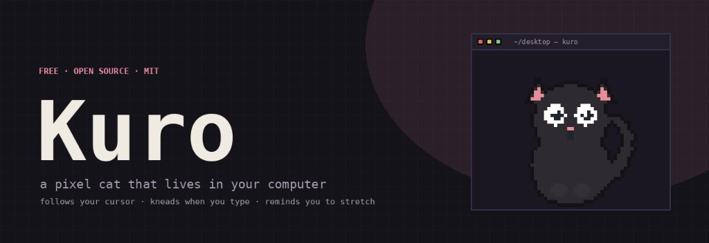
</p>

<p align="center">
  
  
  
  
</p>

<p align="center">
  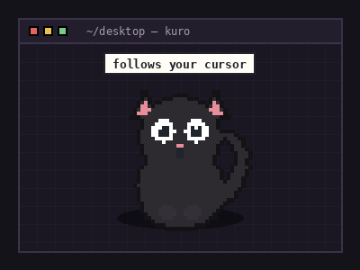
</p>

<p align="center">
  Follows your cursor · kneads when you type · stretches with you<br/>
  runs Pomodoro · hops when your AI agent finishes
</p>

<p align="center">
  <a href="https://github.com/madhavbuilds/Kuro/releases/latest"></a>
  <a href="https://github.com/madhavbuilds/Kuro/releases/latest"></a>
</p>

<p align="center">
  <em>No accounts. No license keys. No spyware.<br/>
  MIT licensed — install it on every machine you own.</em>
</p>

---

## Download

Grab the latest installers from **[GitHub Releases](https://github.com/madhavbuilds/Kuro/releases/latest)** — no build step required.

| Platform | What to get |
|:--|:--|
| **Windows** | `Kuro-Setup-*.exe` (installer) or `Kuro-Portable-*.exe` (no install) |
| **macOS** | `Kuro-*-universal.dmg` (Apple Silicon + Intel) |

Unsigned builds may trip SmartScreen / Gatekeeper — open anyway / right-click → Open on Mac. That's normal for free unsigned apps.

---

## Why you'll keep it open

Kuro is a tiny always-on-top companion drawn **procedurally at runtime** — not a sprite sheet, not a cloud pet. It sits in a transparent click-through window, watches your cursor, reacts to your keyboard, and occasionally reminds you to be a person.

Inspired by [Comnyang](https://comnyang.com); shares **no** code or assets with it.

---

## Features

<table>
  <tr>
    <td width="25%" align="center">
      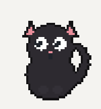<br/>
      <strong>Eye follow</strong><br/>
      <sub>Pupils track your mouse across the whole screen — no invasive hooks, just a polite cursor poll.</sub>
    </td>
    <td width="25%" align="center">
      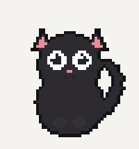<br/>
      <strong>Mouse hunt</strong><br/>
      <sub>Fling the cursor past the cat and it snaps into wide-eyed hunt mode.</sub>
    </td>
    <td width="25%" align="center">
      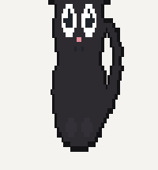<br/>
      <strong>Mochi drag</strong><br/>
      <sub>Grab it and it stretches like mochi; drop it and it jiggles back into place.</sub>
    </td>
    <td width="25%" align="center">
      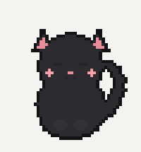<br/>
      <strong>Purring pets</strong><br/>
      <sub>Stroke its head slowly — hearts, blush, and a soft purr.</sub>
    </td>
  </tr>
  <tr>
    <td width="25%" align="center">
      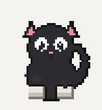<br/>
      <strong>Keyboard kneading</strong><br/>
      <sub>Kneads in time with your typing (optional global hook via <code>uiohook-napi</code>).</sub>
    </td>
    <td width="25%" align="center">
      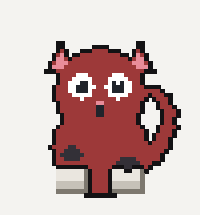<br/>
      <strong>Overheat mode</strong><br/>
      <sub>Type too fast and the cat goes red with steam puffing off its head.</sub>
    </td>
    <td width="25%" align="center">
      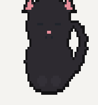<br/>
      <strong>Stretch &amp; water</strong><br/>
      <sub>Timed nudges to stand up and drink — the cat grows big and stretches with you.</sub>
    </td>
    <td width="25%" align="center">
      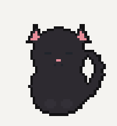<br/>
      <strong>Peek &amp; rest</strong><br/>
      <sub>Slide mostly off-screen in peek mode, or catch it napping between chaos.</sub>
    </td>
  </tr>
</table>

**Also included**

| | |
|:--|:--|
| **Pomodoro** | Focus / break loop with a pixel timer beside the cat — start from the tray |
| **Daily reminder** | Pick a time + message; it meows the note at you |
| **Pinned note** | Keep something important floating above its head |
| **Name it yours** | Reminders address you by name |
| **AI agent reactions** | Thinking face while a CLI agent works; happy hop + meow when it finishes |
| **Custom coats** | Body / pattern / belly colors · solid · tabby · tuxedo · calico · siamese · size slider |
| **Click-through** | Only captures the mouse when you're actually on the cat |

<p align="center">
  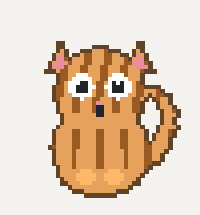
  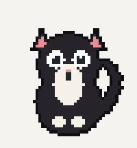
  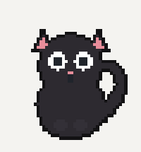
  
</p>

---

## Quick start

Requires **Node.js 18+**.

```bash
git clone https://github.com/madhavbuilds/Kuro.git
cd Kuro
npm install
npm start
```

The cat appears bottom-right.

| Action | What happens |
|:--|:--|
| **Drag** | Move it anywhere |
| **Double-click** | Meow |
| **Right-click** | Open settings |
| **Tray icon** | Pomodoro / quit |

---

## Global keyboard kneading

`uiohook-napi` is optional. If it builds, you get typing reactions. If it doesn't, everything else still works and the tray shows *Global keyboard: unavailable*.

```bash
npm install uiohook-napi
```

- **macOS** — grant Accessibility when prompted  
- **Linux** — you may need `libxtst-dev`

---

## Hook up your AI agent

Kuro listens on a localhost hook. Any tool that can run a shell command can drive the cat:

```bash
curl -s -X POST http://127.0.0.1:41999/agent \
  -H 'Content-Type: application/json' \
  -d '{"state":"thinking"}'
```

| State | Cat reacts with |
|:--|:--|
| `thinking` | Focused / waiting face |
| `done` | Happy hop + meow |
| `waiting` | Patient stare |
| `idle` | Back to normal |

<details>
<summary><strong>Claude Code</strong> — drop this into <code>~/.claude/settings.json</code></summary>

```json
{
  "hooks": {
    "UserPromptSubmit": [
      {
        "hooks": [
          {
            "type": "command",
            "command": "curl -s -X POST http://127.0.0.1:41999/agent -H 'Content-Type: application/json' -d '{\"state\":\"thinking\"}' >/dev/null 2>&1 || true"
          }
        ]
      }
    ],
    "Stop": [
      {
        "hooks": [
          {
            "type": "command",
            "command": "curl -s -X POST http://127.0.0.1:41999/agent -H 'Content-Type: application/json' -d '{\"state\":\"done\"}' >/dev/null 2>&1 || true"
          }
        ]
      }
    ]
  }
}
```

</details>

The same curls work from Codex hooks, git hooks, Makefiles, CI scripts — anything local.

---

## Build installers (from source)

Prefer the [GitHub Releases](https://github.com/madhavbuilds/Kuro/releases/latest) downloads above. To build yourself:

```bash
npm run dist          # current OS
npm run dist:win      # Windows — NSIS + portable
npm run dist:mac      # macOS — universal dmg + zip
npm run dist:linux    # Linux — AppImage
```

Pushing a `v*` tag runs CI and publishes Windows + macOS installers to GitHub Releases automatically.

---

## Start with the system

| OS | How |
|:--|:--|
| **Windows** | `Win+R` → `shell:startup` → drop a shortcut to the exe |
| **macOS** | System Settings → General → Login Items → add Kuro |
| **Linux** | Add a `.desktop` entry under `~/.config/autostart/` |

---

## Privacy

- No network calls except the **localhost** agent hook you control  
- Cursor position stays in-process  
- Keystroke *timing* only — key contents are discarded  
- Settings live in a local JSON file under Electron `userData`

---

## License

[MIT](LICENSE) — free as in “put a cat on every desk.”
# Kuro
